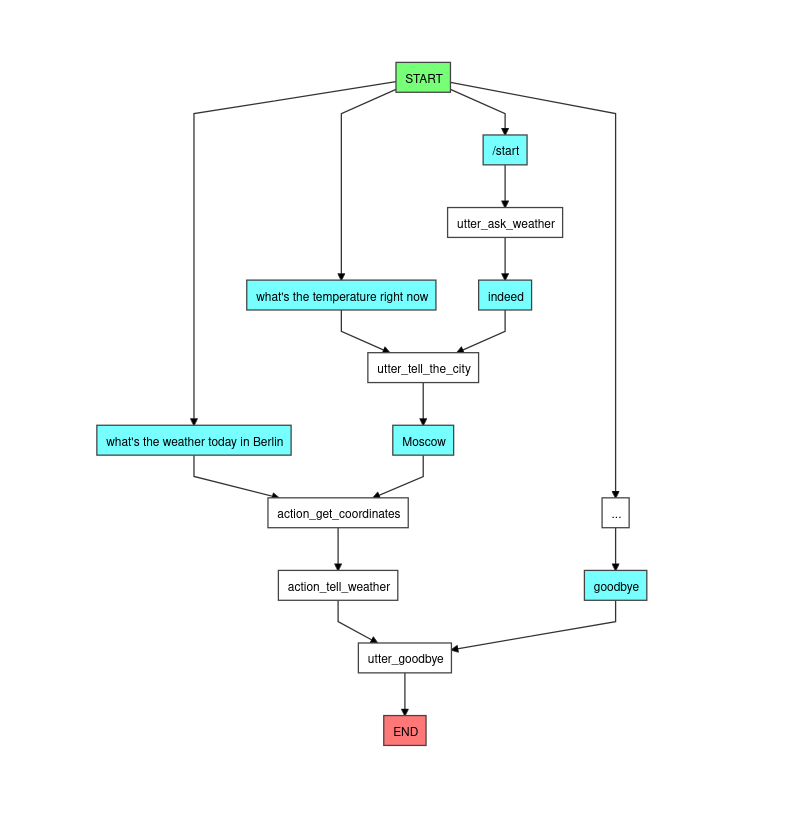

# Rasa Weather Bot

## Описание
Это небольшой учебный проект в рамках вуза, основная цель которого - использовать технологии на основе машинного обучения для практической пользы.

Бот умеет говорить погоду (температура, осадки) в нужном городе сегодня и предсказывает ее на завтра.

Основной диалоговый фреймворк - Rasa 3.4.0

## Источники данных:
### Погода
Для погоды используется OpenMeteo

API Документация: \
https://open-meteo.com/en/docs

Пример запроса для города Colorado Springs: \
https://api.open-meteo.com/v1/forecast?latitude=38.83&longitude=-104.82&current_weather=True&timezone=GMT&daily=temperature_2m_min,temperature_2m_max,weathercode

### Геокодер
В качестве геокодера взят Nominatim из OpenStreetMap

## Запуск
1. ``rasa train`` \
2. ``rasa run actions`` \
3. ``rasa shell``